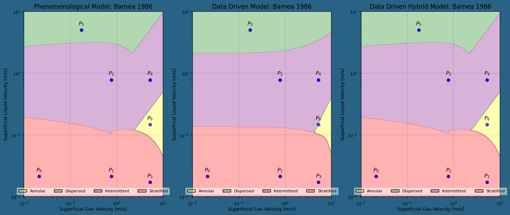

# **FlowTechLIB: Flow Tech Library**

## **Installation with pip**
Initially, the installation will be done locally. To do this, execute the line below:

<table>
  <tr>
    <th align="left">Purpose</th>
    <th align="left">Version</th>
    <th align="left">Branch</th>
    <th align="left">Build</th>
    <th align="left">Command</th>
  </tr>
  <tr>
    <td>PetroBras</td>
    <td>v0.1.26</td>
    <td><a href=" ">stable</a></td>
    <td><a href=" "></a></td>
    <td><code>pip3 install . </code></td>
  </tr>
</table>

When installing the library, the installation also installs the dependencies necessary for the library to function.

## **Usage**
In a python script, import the FLowTech library by doing:

```python
from flowtechlib import *
```
### **Flow Pattern**:

#### **Parameters**

#### **The parameters to generate the phenomenological flow pattern map are**:

#### Liquid (Fluid 1)
* **Maximum and minimum velocity** $(m/s)$: "vel_max_liq" and "vel_min_liq"
* **Liquid Viscosity** $(Pa\cdot s)$: "visc_liq"
* **Liquid density** $(Kg/m^3)$: "dens_liq"

#### **Gas (Fluid 2)**
* **Maximum and minimum velocity** $(m/s)$: "vel_max_gas" and "vel_min_gas"
* **Gas viscosity** $(Pa\cdot s)$: "visc_gas"
* **Gas density** $(Kg/m^3)$: "dens_gas"

#### **Interfacial Tension**:
* **Interfacial Tension** $(N/m)$: "inte_tens"

#### **Geometry**:
* **Tube diameter** $(m)$: "diam"
* **Tube slope** (radians): "incl"
* **Mesh resolution** (integer): "resol"

#### **Phenomenological models**: "fenomenol"
* "Barnea 1986"
* "Shoram 2005"
* Others - In the future!

#### **Data-driven models**: "data_driven"
* "Random Forest"
* "MLPC" 
* Others - In the future!

#### **You can insert extra points to plot on flow pattern maps**:
* **Gas Velocity List** $(m/s)$: "ext_point_vg"
* **Liquid Velocity List** $(m/s)$: "ext_point_vl"
* **Note 1**: The lists must have the same dimension.
* **Note 2**: For the plotting of results, the additional gas velocities must have values within the range of the minimum and maximum gas velocities. Analogously, the additional liquid velocities must fall within the range of the minimum and maximum liquid velocities.

Here's an example:

```python
ext_point_vg = [0.0211, 0.7781, 0.7781, 5.3010, 5.3010, 0.1760, 5.3010]
ext_point_vl = [0.0211, 0.0211, 0.7781, 0.0170, 0.7781, 5.0000, 0.1461]

parms = {
        "fluid1" : "Water" ,
        "vel_min_liq" : "0.01" ,
        "vel_max_liq" : "10.0" ,
        "visc_liq" : "0.001139" ,
        "dens_liq" : "999" ,
        "fluid2" : "Air" ,
        "vel_min_gas" : "0.01" ,
        "vel_max_gas" : "10.0" ,
        "visc_gas" : "0.000017965" ,
        "dens_gas" : "1.2257" ,
        "inte_tens" : "0.0735" ,
        "diam" : "0.0254" ,
        "incl" : "0.0" ,
        "data_driven" : "Random Forest" ,
        "fenomenol" : "Barnea 1986" ,
        "resol" : "250",
        "ext_point_vl": ext_point_vl,
        "ext_point_vg": ext_point_vg
        }
```
There are several examples in the "examples.py" file. To access the examples, follow the example below:

```python
from flowtechlib import exemples
parms = exemples.exemple_1_Barnea
```

#### **Initializing and information about the set parameters**:
Initially, we need to create an instance that manages the set parameters. To achieve this, we instantiate the 'Patterns' class by executing:

```python
pat = Patterns(parms)
```

To view the parameters that have been set, we execute:

```python
pat.info()
```

#### **Phenomenological flow pattern**:
To generate the phenomenological flow pattern map with the model set in the parameters, one must first create an instance of the 'Phenom' class by executing:


```python
phe = Phenom(parms)
phe.PhenomPatternsMap()
```

When the 'PhenomPatterns' function is executed on the 'phe' instance, it produces the 'phe.pattern' pattern, which is then used for plotting the image.

#### **Data-Driven flow pattern**:
To generate the phenomenological flow pattern map using the data-driven model that uses the data obtained by the project and with the model defined in the parameters, you must first create an instance of the 'PhenomDataDriven' class, executing:

```python
dat = PhenomDataDriven(parms)
```

To generate the flow pattern using the data-driven model specified in the parameters, using the project database, for all points within the grid created by the specified maximum and minimum velocities, use the following function:

```python
dat.PhenomDataDrivenPatternsMap()
```

#### **Data-Driven flow pattern (Hybrid)**:

```python
dat_hyb = PhenomDataDrivenHybrid(parms, phe.pattern_str)
dat_hyb.PhenomDataDrivenHybridPatternsMap()
```

#### **Plot of the flow pattern map (on a logarithmic scale)**:

```python
import matplotlib.pyplot as plt
fig, ax = plt.subplots(1, 3, figsize=(14, 6))
phe.plot_patterns(fig, ax=ax[0], titlefigure=["Phenomenological Model: "])
dat.plot_patterns(fig, ax=ax[1], titlefigure=['Data Driven Model: '])
dat_hyb.plot_patterns(fig, ax=ax[2], titlefigure=['Data Driven Hybrid Model: '])
plt.show()
```


### **HoldUp and Pressure**
The parameters are basically the same as those used in the case of the flow pattern, with the only differences being the surface velocities, which in this case are single values instead of intervals (minimum and maximum), and the absence of resolution selection, as the results are also single values and not meshes (maps).

```python
parms2 = exemples.exemple_1_Barnea
```

To calculate Pressure Gradient and Holdup with the models defined in the parameters, it is necessary to first create an instance of the 'HoldUp' class, and before that, the 'Patterns' instance must be recreated with the parameters, by executing:

```python
pat = Patterns(parms2)
hu = HoldUp(parms2)
hu_dat = HoldUpDataDriven(parms2)
hu_dat.GradientBoosting()
hu_dat_hyb = HoldUpDataDrivenHybrid(parms2)
```

## Testing
Building...

## Citation

If you use this implementation in you work, please add a reference/citation to the paper. You can use the following BibTeX entry:

```bibtex
@unpublished{FlowTechLib,
  author = {Lemi},
  title = {FlowTechLib},
  note = {},
  url = {https://codigo-externo.petrobras.com.br/co2ee/flowtech}
}
```

## License

